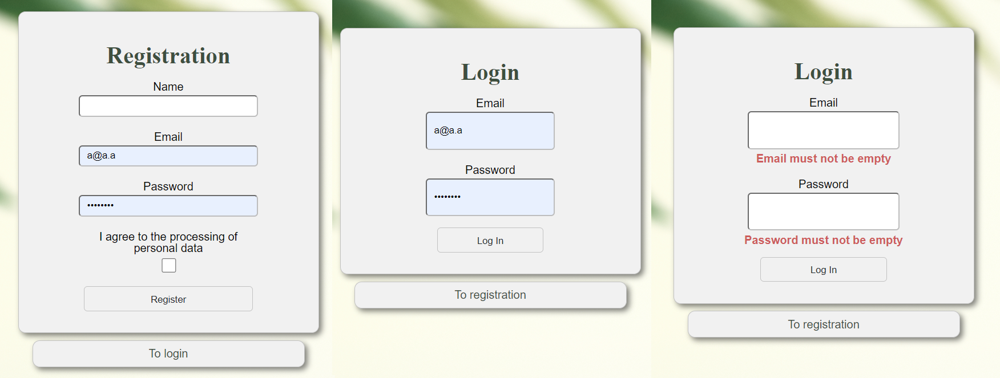
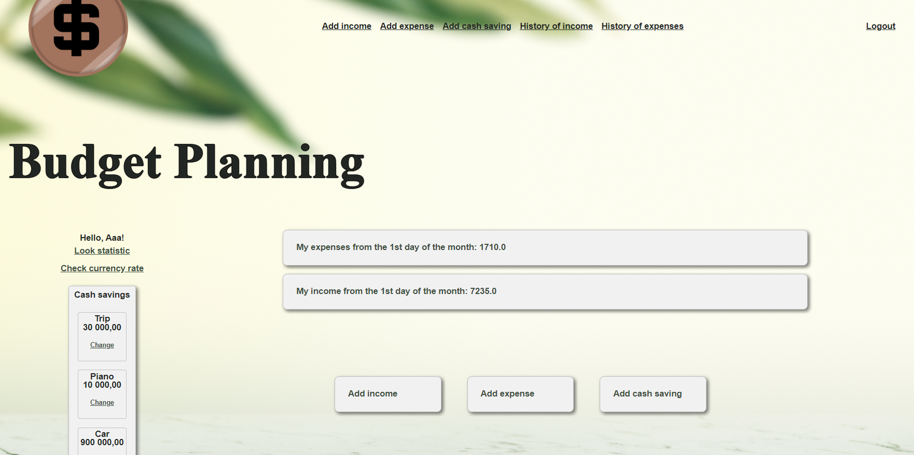
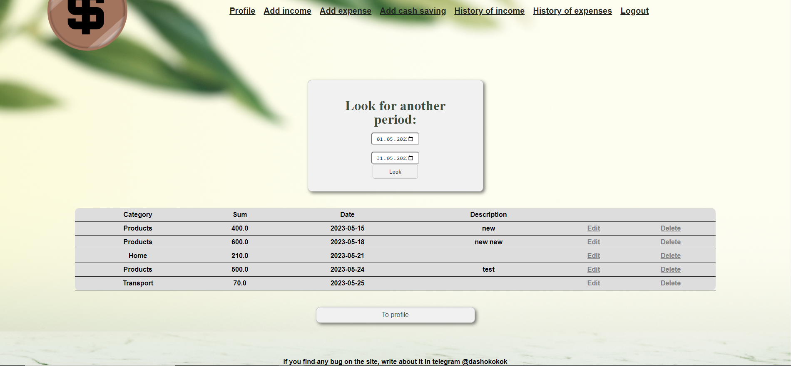
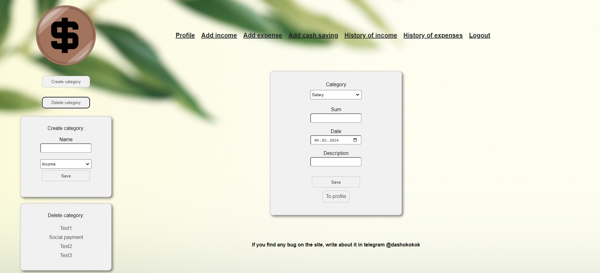
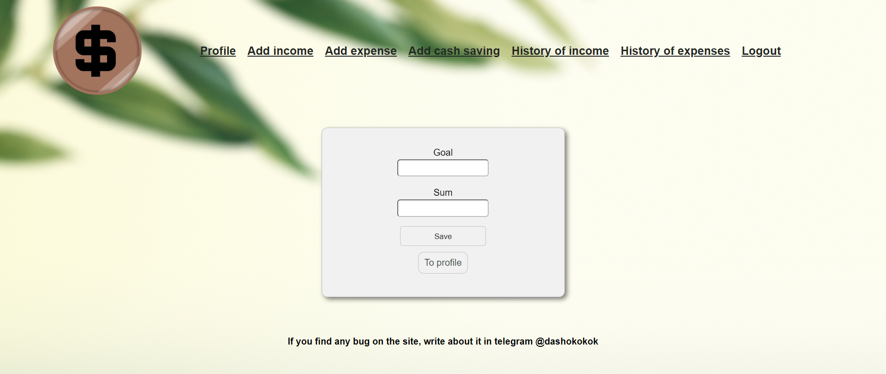
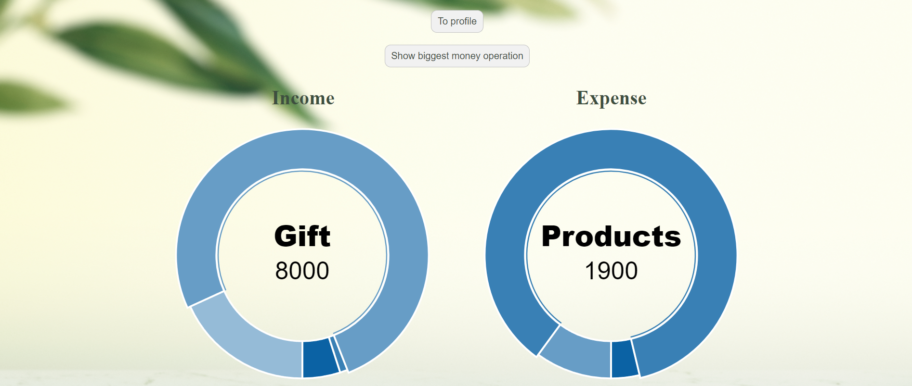
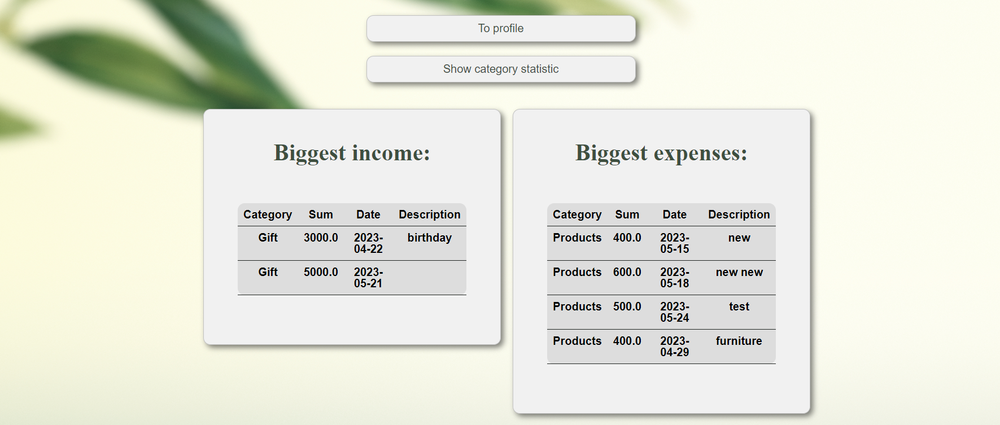
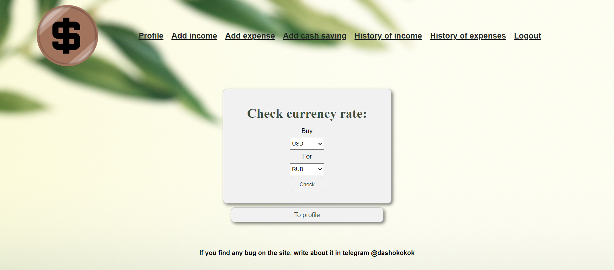

# Budget Planning
Spring. Учебный проект.
### Приложение для учета финансов
Пользователь сайта, если он прошел авторизацию,
может добавлять свои расходы и доходы, смотреть отчет по 
ним за разные периоды, выставлять категории, создавать и 
удалять свои категории, добавлять запись о финансовой цели или
своих сбережениях, смотреть свою статистику, а также проверять 
курс валют.  
  
Регистрация и логин:  
  
  
В профиле отображаются сбережения, кнопки для определенных действий, а
посередине то, сколько человек потратил и заработал с начала
текущего месяца. На эти длинные кнопки можно нажать, чтобы перейти в историю, но
также все нужные ссылки на действия есть в хэдере.  
  
  
В истории изначально отображаются только операции с начала текущего
месяца, но период можно изменить. Также здесь можно удалять и редактировать операции.  
  
  
Добавление операции, создание и удаление своих категорий (манипуляции с категорией происходят
без перезагрузки страницы (для сущности Category организовано REST API)):
  
  
Добавление сбережения:  
  
  
Статистика операций по категориям:

  
Здесь показываются самые большие доходы и расходы:
  
  
Также можно обратиться к сторонней апишке и посмотреть курс валют:
  
  
Насчет тестов Postman: в resources есть json с коллекцией, но для самого тестирования надо залогиниться 
на сайте и брать из куки JSESSIONID и отключать csrf в SecurityConfig.
